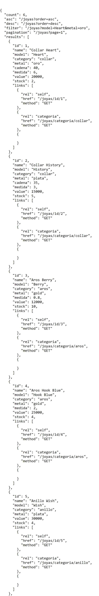
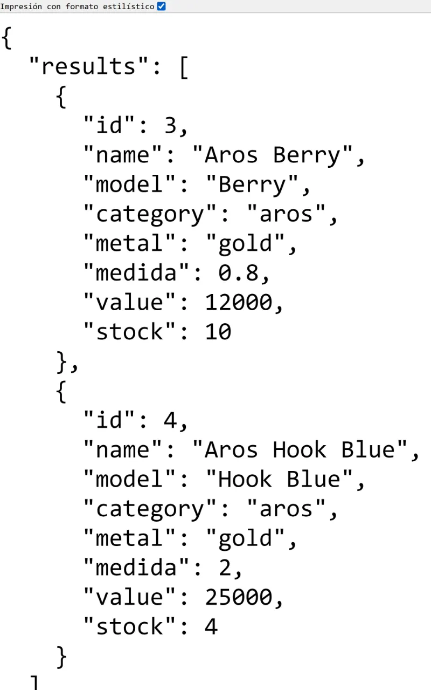
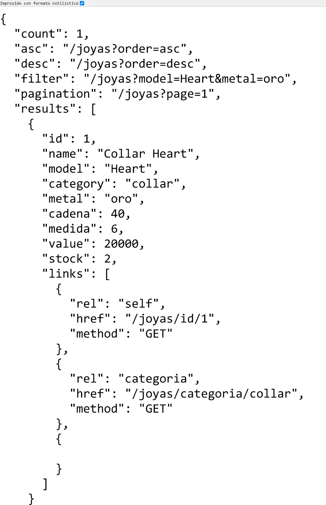
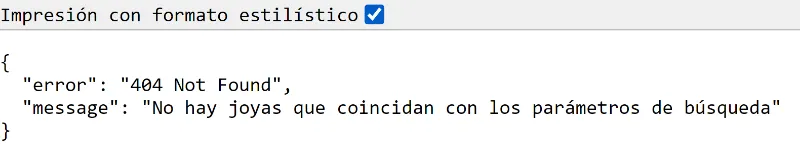
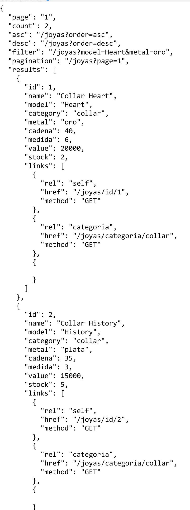
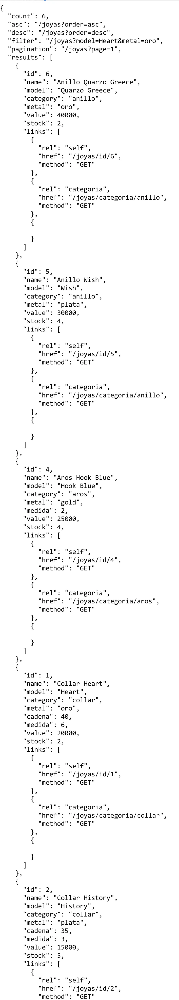

# Resolución de Desafío - Tienda de joyas

Repositorio con el código solución al desafío 3 del módulo 8 llamado **Implementación de API backend Node Express** perteneciente a la beca entregada por Talento Digital para Chile **Desarrollo de aplicaciones Full Stack Javascript Trainee** dictada por Desafío Latam.

## Tabla de Contenido

- [Resolución de Desafío - Tienda de joyas](#resolución-de-desafío---tienda-de-joyas)
  - [Tabla de Contenido](#tabla-de-contenido)
  - [Requisitos](#requisitos)
  - [Deploy](#deploy)
  - [Soluciones](#soluciones)
    - [1. Crear una ruta GET /joyas que devuelva la estructura HATEOAS de todas las joyas almacenadas en la base de datos. (1 Punto)](#1-crear-una-ruta-get-joyas-que-devuelva-la-estructura-hateoas-de-todas-las-joyas-almacenadas-en-la-base-de-datos-1-punto)
    - [2. Crear una ruta GET /joyas/categoria/:categoria que devuelva solo las joyas correspondientes a la categoría obtenida. (2 Puntos)](#2-crear-una-ruta-get-joyascategoriacategoria-que-devuelva-solo-las-joyas-correspondientes-a-la-categoría-obtenida-2-puntos)
    - [3. Crear una ruta GET /joyas que permita el filtrado por campos de las joyas. (2 Puntos)](#3-crear-una-ruta-get-joyas-que-permita-el-filtrado-por-campos-de-las-joyas-2-puntos)
    - [4. Crear una ruta que devuelva como payload un JSON con un mensaje de error cuando el usuario consulte el id de una joya que no exista. (1 Punto)](#4-crear-una-ruta-que-devuelva-como-payload-un-json-con-un-mensaje-de-error-cuando-el-usuario-consulte-el-id-de-una-joya-que-no-exista-1-punto)
    - [5. Permitir hacer paginación de las joyas usando Query Strings. (2 Puntos)](#5-permitir-hacer-paginación-de-las-joyas-usando-query-strings-2-puntos)
    - [6. Permitir hacer ordenamiento de las joyas según su valor de forma ascendente o descendente usando Query Strings. (2 Puntos)](#6-permitir-hacer-ordenamiento-de-las-joyas-según-su-valor-de-forma-ascendente-o-descendente-usando-query-strings-2-puntos)

## Requisitos


## Deploy

El proyecto es completamente funcional y ha sido desplegado en Vercel. Se puede acceder al proyecto en el siguiente [link](https://desafio-tienda-de-joyas.vercel.app/).

## Soluciones

### 1. Crear una ruta GET /joyas que devuelva la estructura HATEOAS de todas las joyas almacenadas en la base de datos. (1 Punto)

He creado la siguiente ruta que cumple con lo solicitado:

```js
router.get("/joyas", renderJoyasHATEOAS);
```

Para lo cual utilizo la siguiente función:

```js
export function renderJoyasHATEOAS(req, res) {
  const { order, page, ...queryParams } = req.query;
  try {
    if (Object.keys(req.query).length == 0) {
      res.json(HATEOAS(joyas));
    } else {
      const joyasOrdenadas = orderData(joyas, order);
      const joyasPaginadas = paginationData(joyasOrdenadas, page);
      const joyasFiltradas = filtrarData(joyasPaginadas, queryParams);

      if (joyasFiltradas.length == 0) {
        res.json({
          error: "404 Not Found",
          message: "No hay joyas que coincidan con los parámetros de búsqueda",
        });
        return;
      }
      res.json(HATEOAS(joyasFiltradas, page));
    }
  } catch (error) {
    res.json(error);
  }
}
```

En el navegador obtengo lo siguiente:



### 2. Crear una ruta GET /joyas/categoria/:categoria que devuelva solo las joyas correspondientes a la categoría obtenida. (2 Puntos)

He creado la siguiente ruta que cumple con lo solicitado:

```js
router.get("/joyas/categoria/:categoria", getCategorias);
```

Para lo cual utilizo la siguiente función **getCategorias**:

```js
export function getCategorias(req, res) {
  try {
    const { categoria } = req.params;
    const categoriaFiltrada = joyas.filter(
      (joya) => joya.category === categoria,
    );
    res.json({ results: categoriaFiltrada });
  } catch (error) {
    res.send("Error", error);
  }
}
```

En el navegador obtengo lo siguiente:



### 3. Crear una ruta GET /joyas que permita el filtrado por campos de las joyas. (2 Puntos)

Para filtrar la data por medio de sus atributos he creado la siguiente función:

```js
export function filtrarData(joyas, objetoCampos) {
  if (Object.keys(objetoCampos).length == 0) {
    return joyas;
  }
  const joyasFiltradas = joyas.filter((joya) => {
    for (let key in objetoCampos) {
      if (joya[key] != objetoCampos[key]) {
        return false;
      }
    }
    return true;
  });
  return joyasFiltradas;
}
```

En pantalla obtengo lo siguiente:



### 4. Crear una ruta que devuelva como payload un JSON con un mensaje de error cuando el usuario consulte el id de una joya que no exista. (1 Punto)

Cuando se consulta un id que no existe muestro lo siguiente:

```js
res.json({
  error: "404 Not Found",
  message: "No hay joyas que coincidan con los parámetros de búsqueda",
});
```

El cual incluyo en el siguiente middleware:

```js
export function getJoyabyId(req, res) {
  try {
    const { id } = req.params;

    const joya = joyas.find((joya) => joya.id === +id);
    if (Object.keys(joya) !== 0) {
      res.json({ results: joya });
    } else {
      throw new Error(
        "No hay joyas que coincidan con los parámetros de búsqueda",
      );
    }
  } catch (error) {
    res.json({
      error: "404 Not Found",
      message: "No hay joyas que coincidan con los parámetros de búsqueda",
    });
  }
}
```

En pantalla se muestra lo siguiente:



### 5. Permitir hacer paginación de las joyas usando Query Strings. (2 Puntos)

Para realizar la paginación he creado la siguiente función:

```js
export function paginationData(joyas, page) {
  // cantidad maxima de elementos por pagina 5

  const cantidadMaximadeElementosPorPagina = 2;
  const inicio = (page - 1) * cantidadMaximadeElementosPorPagina;
  const final = page * cantidadMaximadeElementosPorPagina;
  if (isNaN(inicio) || isNaN(final)) {
    return joyas;
  }
  return joyas.slice(
    cantidadMaximadeElementosPorPagina * (page - 1),
    cantidadMaximadeElementosPorPagina * page,
  );
}
```

Dicha función realiza la paginación mostrando como máximo dos elementos en pantalla. En pantalla se muestra lo siguiente:



### 6. Permitir hacer ordenamiento de las joyas según su valor de forma ascendente o descendente usando Query Strings. (2 Puntos)

He creado la siguiente función que me permite ordenar la data en función de su **value**:

```js
export function orderData(joyas, order) {
  const newJoyas = [...joyas];
  if (order == "asc") {
    return newJoyas.sort((a, b) => +a.value - +b.value);
  }
  if (order == "desc") {
    return newJoyas.sort((a, b) => +b.value - +a.value);
  }
  return newJoyas;
}
```

A continuación muestro la data ordenada de manera descendente en función de su valor:


